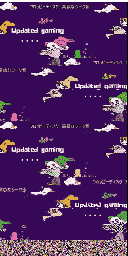

# CYNTHIA64専用のスプライトで動画再生「sp512p.x」  -X68000-APL-  
   

## 概要  
CYNTHIA（スプライトコントローラー）のメモリを32KBから64KBへ増設したPCGエリアを活用し、動画再生を実現するプレイヤーです。 

## 特徴  
* panicやMACSと違って気軽にデータが作れるところ(作成方法は別途)  

## 注意事項  
1. メモリ増設されてないCYNTHIAでは、正しく表示されません。  
1. 音声の再生には、PCM8Aの常駐が必要です。
1. 動画の再生時間を正確に制御するため、Timer-Dを使用します。  

## 動作環境  
* X68000（CYNTHIA64に改造された本体） 
* メモリ2MB以上  
* FLOAT2.X　または、その互換ドライバ  
* IOCS.X　または、その互換ドライバ  
* PCM8A.x  
* fullpat.x (XEiJに付属)。  
* TDPAUSE.r (WANT)　一時的にTimer-Dを解放できるようになる。  

## 実行  
* 付属のstart.batを実行ください。(動作環境)  

## 強制終了方法  
* ESCキーを長押し  

## データの作成方法  
「VIDEO→SPRITE+ADPCM.html」ブラウザで開き、変換したい動画ファイルを選択します。  
変換するサイズは、240 x 128 としてください。
変換を開始すれば、数分後「ダウンロード」フォルダに「out.wav」「out.sp」「out.pal」が作成されます。（本当はWAV→PCM変換もしたかった…開発中）  

## データを登録する方法  
「data」フォルダに、「sample_240x128」（ひな形）があります。  
「sample_240x128」フォルダを複製してリネームします。  
「datalist.txt」ファイルの中身をテキストエディタでリネームした名前に変更ください。  
「データの作成方法」で作成したデータを
「se」フォルダにout.pcmを保存します。続いて、  
「sp」フォルダに「out.sp」、「out.pal」を保存します。  

## 仕組み  
ストレージからスプライトデータを読み込み、そのままPCGエリアを書き換えています。通常、257枚目以降のスプライトデータは存在しませんが、メモリ増設により、それらの領域への読み書きが可能になっています。表示時には、257枚目以降に定義されたスプライトデータであっても、スプライトレジスタのバンク切り替えビットを立てるだけで、従来どおり制御対象のスプライトとして扱うことができます。

## やることリスト  
* エラー処理が未実装です。  
* 早送り、巻き戻し、一時停止

## 開発環境  
* X680x0 EMULATOR XM6 TypeG version 3.38  
* X680x0 EMULATOR XEiJ version 0260428  
* X68000 真理子バージョン Based on GCC 1.42  
* X68k High-speed Assembler v3.09+90  
* HLK evolution version 3.01+17  

## 謝辞  
* CYNTHIA64開発の紅茶羊羹さん  
* 68エミュレーター開発のGIMONSさん、Makoto Kamadaさん  
* X68KBBSのメンバーの皆様  

## 履歴  
* 2025/05/17	ver.1.0.0  
  - コンバーターとデータのひな形を作った（プログラムに変更なし）  
* 2025/05/12	ver.1.0.0  
  - 時間ずれを修正「sp512p.x」として、X68KBBSにてVerUPを公開  
* 2025/05/04	ver.0.1.2  
  - パレット変更して多彩な動画に対応  
* 2025/04/28	ver.0.1.1  
  - 特別ミッションスタート 他の動画でも再生できるように検証を開始する  
* 2025/04/26	ver.0.1.0 
  - X68KBBSにて公開。実機検証の協力をいただきました  
* 2025/04/25	ver.0.0.1  
  - 無改造の実機でテスト  
* 2026/04/01	ver.0.0.0  
  - 開発スタート ハイメモリ対応MACSのノリで開始  
* 2026/03/27  
  - CYNTHIA64の基板をゲット  
